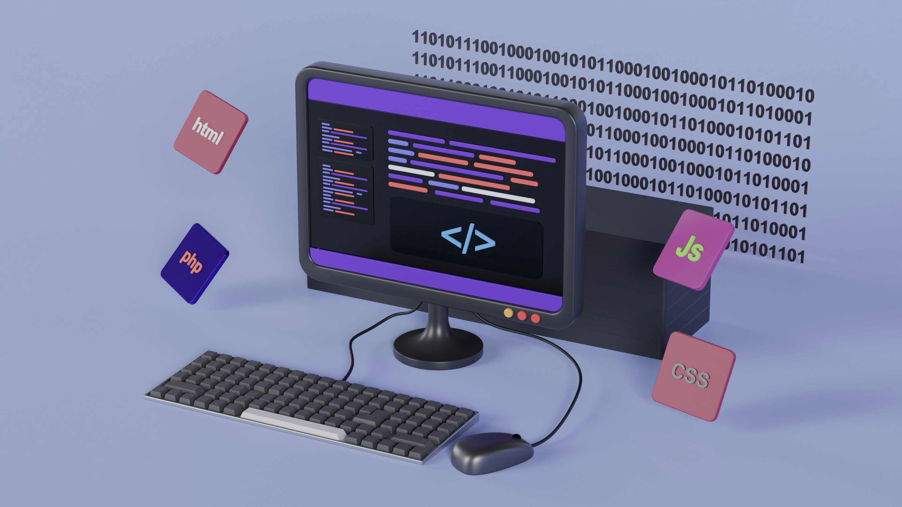

# Artificial Intelligence & Data Science Portfolio

 

## Machine Learning | Deep Learning & Time Series | Generative AI | Agentic AI

 

#### AI-Powered Email Triage Decision Support System
This project showcases an AI-powered Decision Support System that transforms enterprise email triage into an intelligent, automated workflow. It classifies emails by department, ranks them by priority, generates concise summaries, and recommends contextual actions — reducing manual effort and decision fatigue. Built using GPT-3.5, BART NLI, Hugging Face embeddings, ChromaDB, LangChain, and Streamlit, it combines cutting-edge NLP with a modular, scalable architecture. A LangGraph-based implementation is also available to demonstrate structured workflow orchestration. Designed for seamless integration into real-world enterprise systems, it enhances operational efficiency across departments. 

 
 

#### Agentic RAG Q&A Assistant for SDLC & Azure | Multi-Domain QA with LangGraph, OpenAI & ChromaDB
This project implements a multi-domain Agentic RAG Q&A assistant that intelligently routes queries to domain-specific pipelines for SDLC and Azure Cloud. Built with LangGraph, OpenAI GPT-3.5 Turbo, and dual ChromaDB vector stores, it enables precise, context-driven answers. The system features dynamic routing, autonomous reasoning, and a Streamlit UI—making it ideal for onboarding and cross-functional support in fast-growing tech teams.

 
 

#### Multi-Agent RAG Support System for Azure and AWS Users Using CrewAI
The project showcases a multi-agent RAG-based support system that autonomously handles technical queries related to Azure and AWS cloud platforms. Built using CrewAI, it features intelligent agent collaboration—routing queries, retrieving context from cloud documentation, and refining responses into clear, email-style outputs. The architecture demonstrates role-based agent orchestration, autonomous reasoning, and retrieval-grounded generation, making it suitable for enterprise support, internal tooling, or cloud onboarding use cases.

 
 

#### RAG Based SDLC Q&A Assistant using LangChain, OpenAI GPT & ChromaDB
This project demonstrates a GenAI-powered Q&A assistant for the Software Development Lifecycle (SDLC) using Retrieval-Augmented Generation (RAG). It combines LangChain, OpenAI GPT, and ChromaDB with contextual memory to deliver accurate, real-time answers from SDLC documentation. Designed with a Streamlit interface, it streamlines developer onboarding and enhances enterprise IT support through intelligent, domain-aware assistance.

**Blogs:**

[Cosine Similarity For Natural Language Processing — From Words To Vectors](https://medium.com/@chaudhuri.anusha1/cosine-similarity-for-natural-language-processing-from-words-to-vectors-2b5a9ddfec69)

[Vector Stores Demystified: Unlocking Smarter Semantic Search with ChromaDB and More](https://medium.com/@chaudhuri.anusha1/vector-stores-demystified-unlocking-smarter-semantic-search-with-chromadb-and-more-7232446971a5)
 
 

#### IT Support Ticket Classification Using NLP, Deep Learning And LLMs
This project automates IT support ticket classification using NLP techniques, combining traditional machine learning models and deep learning architectures  like GRU, LSTM with pre-trained GloVe embeddings. The optimized LSTM model demonstrates high accuracy and F1-score, significantly improving ticket categorization efficiency for IT service management. Building on this, the project extends its approach by integrating Llama 3.1 LLM tuned with PEFT-based fine-tuning using LoRA. This extension showcases the ability to apply cutting-edge LLMs to real-world text classification problems, offering a more scalable solution for ticket triaging.

 
 

#### Time-Series Analysis - Forecasting Enterprise Software License Usage and Expenses
This project has two parts, focusing on forecasting enterprise software license usage and expenses by analyzing historical monthly data. The goal is to help organizations proactively plan a cost effective budget, optimize software license procurement and allocation strategies by identifying seasonal trends in license demand and expenses. Various time series analysis techniques have been applied, and different models have been fitted like SARIMAX, LSTM to generate forecasts.

 
 

#### Jet Engine Remaining Useful Life (RUL) Prediction Using Deep Learning
This project focuses on predicting how long a jet engine can continue to operate before maintenance is required — a critical task in aviation safety and operational efficiency. By capturing temporal patterns from multivariate sensor data, the model intelligently learns engine wear behavior and forecasts future degradation. The solution demonstrates the use of LSTM models for time-series analysis in predictive maintenance, enabling smarter, data-driven decision-making in aerospace engineering.

 
 

#### Automotive Engines Health Classification For Predictive Maintenance
This project aims to classify the health status of automotive engines based on real-time sensor data, helping identify engines at risk of failure before breakdowns occur. Through rigorous feature selection, feature engineering, model evaluation, and interpretable insights, the solution uncovers key indicators of engine stress and degradation. By applying machine learning models like Logistic Regression, XgBoost to powertrain diagnostics, the project demonstrates the potential of data-driven maintenance in enhancing vehicle reliability and performance.

 
 

#### Loan Risk Assessment And Loan Default Prediction Using Machine Learning
This project analyzes Lending Club loan applications to identify factors that contribute to loan defaults. It includes an in-depth exploratory data analysis (EDA) followed by the prediction of loan repayment outcomes (fully repaid vs. charged off). The model utilizes PCA for dimensionality reduction and machine learning ensemble models, such as Random Forest and XGBoost, to improve risk assessment and optimize lending strategies.

**Blog:**
[Demystifying Machine Learning Evaluation Metrics — Precision, Recall, ROC And More](https://medium.com/@chaudhuri.anusha1/demystifying-machine-learning-evaluation-metrics-precision-recall-roc-and-more-e84d51b57766)

 
 

#### Gen AI - Dialog Summarization Using LLMs
This project combines prompt engineering and fine-tuning using Parameter-Efficient Fine-Tuning (PEFT) to train the Flan T5 large language model (LLM) for dialog summarization. Dialog summarization has significant real-time applications, including summarizing IT support desk interactions, call center conversations, educational tutorial transcripts, legal documents, and meeting conferences. This solution enhances productivity and information accessibility in critical sectors.

 
 

#### Bike Rental Demand Prediction Using Regression Models
This project develops and evaluates multiple regression models—including Linear Regression with RFE, VIF, and p-values, as well as Ridge and Lasso Regression—to forecast shared bike demand for a Bike Rental Company. By analyzing key factors such as weather, temperature, day of the week, and season, the model leverages historical usage data to help the company better adapt to shifting customer behaviors in the post-pandemic landscape, optimizing bike availability and operational efficiency.

**Blog:**
[Linear Regression — Starting From The Straight Line](https://medium.com/@chaudhuri.anusha1/a-beginners-basic-guide-to-linear-regression-starting-from-the-straight-line-b73a2ea0128c)

 
 
